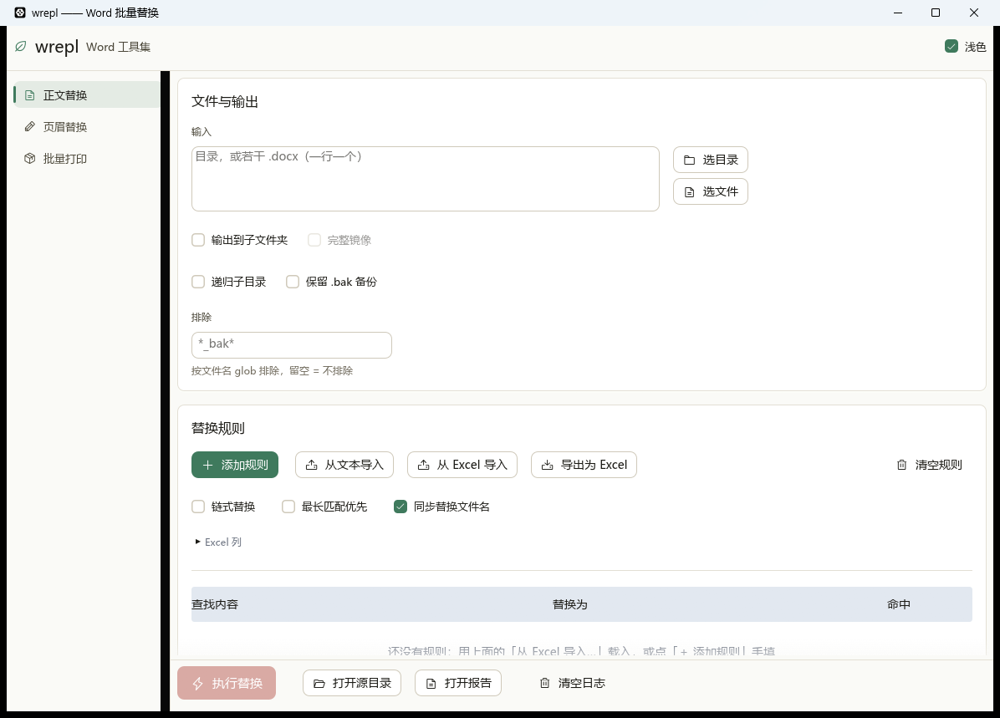
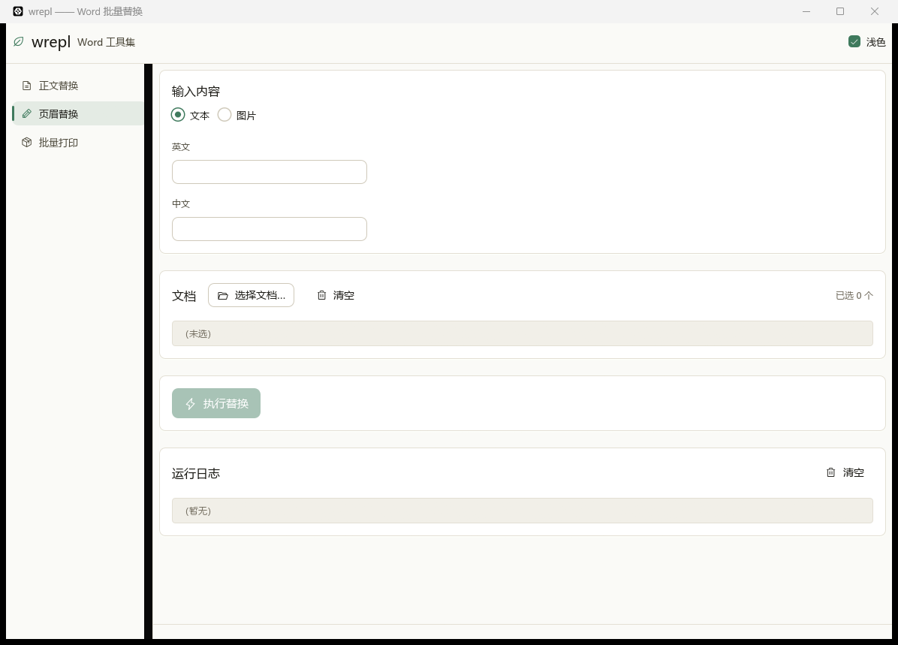
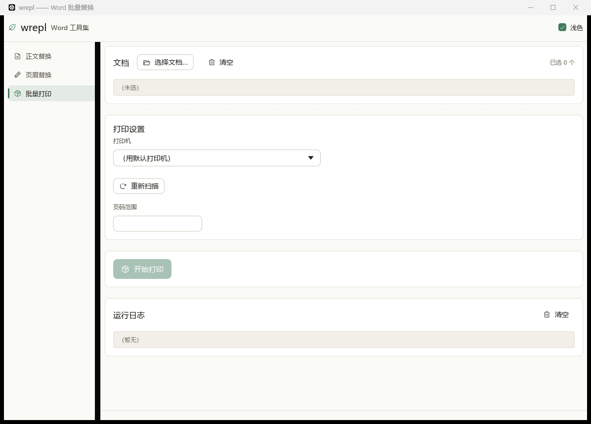

# wrepl

> Word 批量替换工具（.docx）——**外科手术式改 XML，不重建文档**。
> 只替换文字，段落样式、编号、表格、页眉页脚、修订标记一个字都不动。
>
> A batch find-and-replace tool for `.docx` that edits the OOXML inside the
> package instead of regenerating the document, so all original formatting —
> styles, numbering, tables, headers, revision marks — survives untouched.

**正文替换**不依赖 Word / Office / LibreOffice，纯 Rust，命令行与图形界面共用同一套内核。

图形界面另有**页眉替换**与**批量打印**两页 —— 那两页通过 COM 驱动 Word，
**需要本机装 Microsoft Word**（正文替换不受影响，见下面「图形界面」）。

---

## 下载

- **直接用** —— 去 [Releases](../../releases) 取 `wrepl-<版本>-x64-windows.zip`，
  解开是两个免安装的可执行文件：

  | 文件 | 怎么用 |
  |---|---|
  | **`wrepl-gui.exe`** | **图形界面 —— 双击这个** |
  | `wrepl.exe` | 命令行版，在 cmd / PowerShell 里运行（双击它只会一闪而过） |

  **正文替换不需要装 Word / Office，也不需要额外装 DLL** —— 界面上的「页眉替换 / 批量打印」
  两页除外，那两页要本机有 Microsoft Word；包里附同目录的 `.sha256` 校验值。

### 系统要求

| | 要求 |
|---|---|
| 系统 | **64 位 Windows 10 及以上**（所用 Rust 工具链从 1.78 起已不支持 Win7/8） |
| CPU | x64 |
| 运行库 | **什么都不用装** —— CRT/UCRT 静态链接进 exe，包里不含也不依赖 `VCRUNTIME140.dll` 之类 |
| 依赖的 DLL | **全部是 Windows 自带**（`kernel32` / `user32` / `gdi32` / `opengl32` …），见
`.github/scripts/check_pe_imports.py`，发版时逐个核对，白名单外一律拒绝发布 |
| 显卡 | `wrepl.exe`（命令行版）**无任何要求**；`wrepl-gui.exe` 需要显卡驱动支持 **OpenGL 2.1 以上** |

### 双击没反应？先看这一条

> **`wrepl-gui.exe` 打不开窗口时，会弹一个对话框说明原因**（0.2.3 起）。
> 如果你看到的**连对话框都没有**，那基本不是程序本身的问题 —— 往下看。

#### 情况 A：弹了对话框，说"窗口没能打开"

这台机器的显卡驱动没有提供 OpenGL 2.1。典型场景：**远程桌面（RDP）会话**、
虚拟机/云主机没开 3D 加速、只装了「Microsoft 基本显示适配器」而没装显卡厂商驱动。

**不影响你干活** —— 同一个包里的命令行版做的是**完全一样的事**（同一套内核），
而且不需要显卡、不需要窗口：

```bat
wrepl.exe apply "要处理的文件夹" --rules-file "规则.txt" --verify-after
```

规则文件每行一条，制表符分隔「查找内容 `<TAB>` 替换为」。先用 `--dry-run` 空跑一遍看命中。
用法与图形界面完全对应，见下面「用法 → 命令行」。

#### 情况 B：连对话框都没有，双击就是没动静

按顺序试，前三条能解决绝大多数：

1. **先解压再运行** —— 不要直接在压缩包里双击 exe。
2. **解除文件锁定** —— 右键 zip → 属性 → 底部勾上「解除锁定」→ 确定，然后再解压。
   从浏览器或邮件下载的文件带「来自 Internet」标记，Windows 会挡。
3. **过 SmartScreen** —— 双击后若出现「Windows 已保护你的电脑」，
   点**「更多信息」→「仍要运行」**。
4. **杀软 / 公司管控** —— 企业环境常把"未签名的个人开发者 exe"**静默拦掉**，
   表现就是双击毫无反应（既没窗口也没提示）。把解压后的目录加进白名单，
   或换一个不受管控的目录（如 `D:\wrepl\`）再试。
5. **看日志** —— `%LOCALAPPDATA%\wrepl\wrepl-gui.log`。在资源管理器地址栏粘
   `%LOCALAPPDATA%\wrepl` 就能打开那个目录。
   - 有 `======== wrepl-gui v0.4.0 启动 ========` → 进程真的起来过，日志末尾会写清结局；
   - **日志文件根本不存在** → 进程压根没被启动，问题在 2/3/4 这三条上。
6. **在命令行里跑**，直接看报错：

   ```powershell
   cd 解压后的目录
   .\wrepl-gui.exe            # 从命令行启动时，stderr 会打在同一个窗口里
   .\wrepl.exe --version      # 能打印版本 = exe 本身没问题，是建窗口那一步的事
   ```

7. 兜底：**直接用 `wrepl.exe`**（命令行版）。它和界面版共用同一套内核，
   功能完全一致，只是没有界面。

---

## 版本历史

每个版本改了什么，见 **[CHANGELOG.md](CHANGELOG.md)**。

已发布版本的**重点**会自动出现在 [Releases](../../releases) 页面对应条目的正文里 ——
发版流程从 `CHANGELOG.md` 抽出与 tag 同名小节**开头的引用行**拼进 Release 正文，
明细留在本仓库的 `CHANGELOG.md` 里（那里可以尽管写细）。
找不到对应小节、或小节里没有那组引用行时，发版会直接失败 ——
不会静默发一个没有更新内容、或正文长得没法看的版本。

---

## 它解决什么问题

手上有一批交付文档（FAT/IQ/OQ/PQ/SAT/MCL/URS…），要把里面的**项目编号**和
**客户名称**统一换成新的，比如：

```
2026-001CE  →  2026-002CE
某某制药有限公司  →  某某生物
Xxx Pharmaceutical Co., Ltd.  →  Xxx Biological
```

用 Word 的"查找替换"逐份打开改、或者用脚本把 docx 拆成 XML 改完再拼回去，
都会碰到同一类麻烦：

- **格式会被动**：换掉整段 `w:r`，字体的加粗、页眉的域、表格里的编号会漂；
- **改动面不可控**：正则一搜一替，容易连带改掉不该碰的地方；
- **改完不知道有没有改坏**：没有可复算的凭据，只能靠肉眼看。

`wrepl` 的做法是把 docx 当 zip 打开，**只在文本承载元素的字符数据上做区间替换**，
其余 part 的字节原样搬过去；改完立刻用两关 + 残留自检来证明"格式确实没被动过"。

---

## 核心保证

| 保证 | 手段 |
|---|---|
| 未改动的 part 字节完全不变 | 逐 part SHA256 比对 |
| XML 骨架（`pPr`/`rPr`/`styles`/表格/分节符）逐 token 相同 | 归一成骨架后比对 |
| `<w:delText>`（修订删除）、`<w:instrText>`（域代码）不被改动 | 数量必须相等，变了即判不合格 |
| 同一批文件无论用几线程、走 GUI 还是 CLI，产物逐字节相同 | 回归里钉死（26/26 SHA256） |
| 规则命中区间重叠时不猜 | 默认两条都不落笔并如实报冲突 |

---

## 用法

### 命令行

```bash
# 先空跑一遍看命中（不落盘）
wrepl apply ./交付包 --rule "2026-001CE=>2026-002CE" --dry-run

# 就地替换源文件（默认行为），顺带改文件名，并做执行后验证
wrepl apply ./交付包 --rules-file 规则.txt --rename-files --verify-after

# 源文件不动，产物写到 ./out
wrepl apply ./交付包 --rule "2026-001CE=>2026-002CE" --out ./out

# 源文件不动，./out 里是整包的完整镜像（没改动的文件也复制过去）
wrepl apply ./交付包 --rule "2026-001CE=>2026-002CE" --out ./out --mirror

# 就地替换但留一份 .docx.bak（默认不留）
wrepl apply ./交付包 --rule "2026-001CE=>2026-002CE" --backup
```

常用子命令：

| 子命令 | 用途 |
|---|---|
| `apply` | 执行替换并落盘 |
| `scan` | 只扫描不落盘，列出每条规则的命中条数 |
| `probe` | 侦察目录，自动列出候选的项目编号与客户名，并可生成建议规则文件 |
| `verify` | 关卡 1+2 比对；`--batch` 时给两个目录，改过名的按 XML 结构指纹配对 |
| `inspect` / `diff` / `dump` | 摸 part 指纹 / 比对 part 差异 / 导出"段落→run 切分"报告 |
| `rules` | `template` 生成规则模板、`dump` 导出、`check` 只校验 |

### 图形界面

双击 `wrepl-gui.exe`。**左侧边栏**三个入口，各管一件事：

| 入口 | 干什么 | 要不要 Word |
|---|---|---|
| **正文替换** | 本工具的主功能：批量替换 docx 里的文字，并验证格式一个字没动 | **不需要** |
| **页眉替换** | 把指定文本或图片写进**页眉表格的首个单元格**，可批量 | **需要** |
| **批量打印** | 批量打印，可选页码范围与打印机 | **需要** |



配色来自 **[`egui_sauge`](https://github.com/macnjil4/egui_sauge) 设计系统**
（sage 绿、九档字号层级、统一的 `Card` / `Button` / `InputField` / `NavItem` /
`SelectField` 等组件）。右上角「浅色」开关切浅色 / 深色两套配色，
**刻意不跟随系统主题** —— 免得同一台机器上的外观随系统飘，演示与截图对不上。

| 页眉替换 | 批量打印 |
|---|---|
|  |  |

深色主题的样子见 [`docs/screenshots/main-replace-dark.png`](docs/screenshots/main-replace-dark.png)。

**正文替换**页分三块：**文件与输出**（选文件、选落点）、
**替换规则**（一张三列表，可手工填、可从文本/Excel 导入导出）、**执行结果**。
「执行替换」是唯一的执行入口，验证在后台一并做完。

> **两处刻意保留原生绘制**（不是漏改）：规则表用 egui 原生的 `Grid`，
> 因为设计系统的 `Table` 单元格只拿得到不可变引用，装不下"逐行可编辑"的表格；
> 文件选择器的**自绘核心**（导航箭头、侧栏、面包屑、表头、列表、图标）保留自绘，
> 只把它的调色板接进设计系统。两处的完整理由写在
> [CHANGELOG.md](CHANGELOG.md) 的 0.4.0 一节。

**页眉替换**页：选「文本」或「图片」→ 填内容（文本分英文 / 中文两栏，都填就是
「英文 + 手动换行 + 中文」；图片可选按表格高度等比缩放）→ 选文档 → 「执行替换」。

**批量打印**页：选文档 → 选打印机 → 填页码范围（留空 = 全部，例 `1-3,5,7-9`）→ 「开始打印」。
打印机默认是「用默认打印机」，此时**不改 Word 的任何设置**；选定了某台则会
**打印前切过去、整批结束后恢复原打印机**，而**切换失败就整批不执行** ——
把文件打到别的打印机上比"没打"严重得多。列表来自系统枚举，刚装了打印机可以点「重新扫描」。

这两页走 Word COM，执行时 Word 会在后台被调起，任务是异步跑的（进度条与「运行日志」在页面下方）。

- **选目录 / 选文件 / 导入·导出 Excel 走的是自绘面板，不是系统对话框**。
  本机上系统对话框每弹一次要等十几秒（企业管控软件给每个新建窗口都记一笔账），
  自绘面板跑在程序自己的窗口里，点开即出。面板支持**映射网盘**（盘符栏直接列出并标注
  「· 网络」，悬停看它映射到哪个 UNC）和**局域网共享路径**（地址栏粘 `\\服务器\共享`
  回车即可）；点表头可排序，`Ctrl`/`Shift` 多选，`Enter` 确认、`Esc` 取消。
  右下角那个「...」是**系统对话框的兜底入口**，自绘面板搞不定的场合可以退回去。
- **输入可多选** —— 「选文件…」按住 Ctrl / Shift 一次挑多个；
  也可以把多个路径直接粘进输入框（一行一个，或用分号隔开）；目录与文件能混着给。
- **执行默认就地替换源文件**；勾「输出到子文件夹」才改成写副本，源文件不动。
  就地模式点「执行替换」会**先弹一次确认**（覆盖不可撤销），点「确认替换」才真的动文件。
- **「同步替换文件名」默认勾上**（命令行 `--rename-files` 仍默认关闭）——
  同一套规则也作用到文件名上；不想动文件名就取消勾选。
- **「完整镜像」** 只在写副本时可勾（见下面「落盘位置」）。

### 规则从哪来

三种来源，可混用：

```bash
--rule "查找=>替换"           # 逐条给，可重复
--rules-file 规则.txt          # 制表符分隔：查找 | 替换 | 作用域 | 选项 | 备注
--rules-book 规则.xlsx         # Excel 规则表
```

**Excel 规则表**有两点和一般工具不一样：

- **表名随意**，不必叫「规则」。按工作表顺序找**第一张读得出条款的表**：
  先找首行能认出列名（"查找内容 / 替换为"）的表，都没有才退回找第一张
  像两列规则表的表（并且要求至少有一行第 2 列有内容，免得把"填写说明"页读成规则）。
  整本都读不出时**明确报错**并逐张列出原因，不会静默当"零规则"跑完。
- **没有序号列**：第 1 列固定是「查找内容」，第 2 列固定是「替换为」。
  再往后的列全部可选，且**按标题名认、列序随意**：
  `区分大小写 / 全字匹配 / 使用通配符 / 区分全半角 / 作用域 / 启用 / 备注`。

### 落盘位置

| 场景 | 行为 |
|---|---|
| `apply` 不给 `--out` | **就地替换源文件**（原文件上直接覆盖） |
| 加 `--backup` | 就地替换时另留一份 `.docx.bak`（只首次生成，始终是最初那版） |
| 给了 `--out DIR` | 写副本，源文件不动（`--backup` 与 `--out` 互斥，明确拒绝） |
| 再加 `--mirror` | 写副本时，**未改动的文件也原样复制过去**，输出目录成为完整镜像 |
| `--dry-run` | 只走完整执行路径，不落盘 |

就地替换不建临时文件、不做 rename，是在原文件上直接改写。代价是失去原子性——
写失败时先把内存里的原件写回去再报错，保底是（勾了才有的）`.bak`。

**默认 `--out` 里只有本次真正改过的文件** —— 一处都没命中的文件不写副本（搬过去只会让
"哪些动过"变模糊）。所以默认的输出目录**不是一个完整镜像**，两份后果要说清：

- 「验证结论」对这类文件不会去读一个不存在的产物：自检对象退回源文件，备注写明
  `未产出（无改动，未写输出目录）`；
- 文件名同步改名也不会去 rename 一个不存在的产物，备注写明 `…，改名未执行`
  （就地替换不受影响：那里的文件名照样归一）。

**要输出目录能整包拿走，就加 `--mirror`**（界面里是「完整镜像」复选框）。此时：

- 未改动的文件**原样复制**过去，与源文件**逐字节相同**（逐文件 SHA256 可复核），
  文件名同样按规则归一；
- 「验证结论」对它们给的是"整文件逐字节一致"，而不是去比 XML 骨架——内容都没动过，
  逐 part 比对得不出任何信息，整文件哈希才是"复制无损"的直接证据；
- 残留自检仍会如实报出里面的旧串（文件本来就没改），备注里跟着一句
  `（该文件未改动，这些旧串本就是原文件内容）`，别误读成"没替换干净"。

顺带：输出目录里若躺着**上一轮留下的同名旧文件**（这轮规则变了、不再命中它），
它不会被当成本次产物去验证，也不会被覆盖，只在备注里点名。

### 规则打架了怎么办

默认模式是**所有规则基于原文同时扫描**，命中区间重叠时**两条都不落笔**并如实报冲突
（"不猜"是刻意的：哪条该赢属于业务判断，工具不替用户决定）。三种应对：

```bash
--chain           # 链式：前一条的输出作为后一条的输入（顺序明确，不再有重叠）
--longest-first   # 重叠时只让「查找内容更长」的那条落笔，被挤掉的如实记进报告
```

也可以先把规则表收拾干净：把「查找内容 == 替换为」的空转规则标成 `启用=否`
——空转规则不只是没作用，它还会把真正要跑的规则**顶成冲突**。

---

## 执行后验证

CLI 加 `--verify-after`、GUI 执行时**恒开**。逐文件做三件事，全部只读：

1. **残留自检** —— 拿「查找内容」回头扫整包（含 `docProps`、图表、`[Content_Types].xml`），
   看还有没有没替换干净的旧串；
2. **关卡 1** —— 除改动过的 part 外逐个比 SHA256；
3. **关卡 2** —— 把 XML 归一成"骨架"逐 token 比对，确保 `pPr`/`rPr`/`styles`/表格/分节符未被动过。

> **基准必须在覆盖源文件之前扣下来。** 就地替换下"磁盘上的原件"会被当场覆盖掉，
> 所以实现是：写盘**前**采一份基准（每 part SHA256 + 每文本 part 骨架 token），
> 写盘**后**立刻比完即弃。报告「验证结论」的**备注**列会写明
> `改动 part：word/footer2.xml` —— **冒号后面是空的就说明没真比过**。

> **没有产物的文件不验产物。** 写副本模式下未命中的文件默认不进输出目录，此时
> 关卡 1/2 无从谈起（压根没有"产物 vs 源文件"这一对），残留自检退回源文件，
> 备注写明 `未产出（无改动，未写输出目录）；残留自检按源文件做`。
> 同一份文件在就地模式下也是这么验的 —— **验证结论不随落盘模式漂移**。

---

## 出问题了怎么办

**双击没反应** → 先看上面「[双击没反应？先看这一条](#双击没反应先看这一条)」。

界面版会把自己的运行日志（含崩溃详情）写到这里：

```text
%LOCALAPPDATA%\wrepl\wrepl-gui.log
```

在资源管理器的地址栏粘 `%LOCALAPPDATA%\wrepl` 就能直接打开那个目录。

界面版跑在 Windows 图形子系统（双击不弹控制台），`stdout` / `stderr` 是无处可看的 ——
万一它中途消失、又没留下任何提示，**这份日志就是唯一的线索**。报问题时请一并附上。
日志超过 1 MB 会自动轮转成 `.log.old`，不会无限长大。

顺带一提，日志末尾本身就能说明是哪种结局：

| 最后一行 | 说明 |
|---|---|
| `!!! PANIC !!!` | 程序内部出错，下面紧跟着出错位置与调用栈（同时会弹对话框） |
| `!!! 建窗失败 !!!` | 窗口没建出来（多半是显卡驱动只给 OpenGL 1.1），同时会弹对话框说清怎么办 |
| `主循环结束` | 窗口被正常关闭，不是崩溃 |
| 两者都没有、埋点也断了 | 进程被外部干掉了（杀软 / 管控套件），或压根没启动 |

## 已知限制

- **只支持 `.docx`**。`.doc`（老的二进制格式）、`wps` 一律**明确拒绝**，不做降级尝试。
- **「页眉替换」与「批量打印」需要本机装 Microsoft Word**（正文替换不需要）。
  这两页通过 COM 驱动 Word —— Word 没装、企业策略禁用了 COM 自动化、
  或者文档正被别的进程独占打开时，任务会失败并在「运行日志」里写明原因，**不会静默跳过**。
- **正文替换不做像素级比对，也不调用 Office**。格式保全靠解析原始字节来证明，
  能力边界是"结构性未改动"，不是"渲染出来一模一样"。
- 使用**通配符**的规则会被**挡在表外并记日志**，绝不降级当普通文本跑。
- 残留自检的扫描范围**大于**可改范围：只替换 6 类文本 part 的 `<w:t>`，
  但会扫一切 `.xml`/`.rels`。所以当文字也出现在文档属性或图表里时，
  会出现"没改但报了残留"——这是设计如此，看报告备注里的
  `（可见文本 N）` 才是真漏改。
- **图形界面需要显卡驱动支持 OpenGL 2.1 以上**（远程桌面、虚拟机、只装了基本显示
  适配器的机器上建不出窗口）。这种情况程序会弹窗说明，并指向命令行版 ——
  命令行版做的是同一件事，不需要显卡。
-   界面版启动时会读系统字体，**优先**用更现代的中文黑体（小米 MiSans / 华为
  HarmonyOS Sans / 思源黑体 / Noto Sans SC / 阿里普惠体 / OPPO Sans）——
  装了就自动用上。都没有时退到微软雅黑 `msyh.ttc`，再退黑体 / 宋体 / 等线，
  最后才用 egui 自带字体（中文会显示成方块）。
  **字体不打包进 exe**（这也是产物一直 6~7 MB 的原因）；装了喜欢的字体想换上去，
  重新打开程序即可。当前实际用的是哪一个，日志里有一行 `设计系统就绪：界面字体 …`。
  图标走 `egui_sauge` 带的 Phosphor 字体，在字体表里排在**中文字体之后** ——
  顺序反了会把界面上所有小写字母吞掉（Phosphor 的 cmap 覆盖 a–z），
  这段事故与修复记在 [CHANGELOG.md](CHANGELOG.md) 的 0.4.0 一节。

---

## 从源码构建

```bash
# ① 只要命令行版 —— 不拉 eframe / winit / glow，编译最快
cargo build --release

# ② 连图形界面一起编
cargo build --release --features gui

# 产物都在 target/release/：wrepl.exe / wrepl-gui.exe
```

- 需要 **Rust ≥ 1.85**（`edition 2024`）；官方 CI 用 `stable`。
- 仓库里**故意没有** `rust-toolchain.toml`（见 `.gitignore`）：开发机上那份锁的是
  Windows **GNU** 工具链（那台机器没装 MSVC），锁进仓库会让 Linux / macOS 上的
  rustup 直接装不上。想复现官方产物请用 `x86_64-pc-windows-msvc`。

### 依赖：有两条要额外说明

| 依赖 | 形式 | 说明 |
|---|---|---|
| `egui_sauge` | **path 依赖** `path = "../egui_sauge"` | 界面设计系统。它锁 `egui 0.34.1`，必须与本仓库的 `eframe 0.34` 一致 —— 错开就会出现"两套 egui 类型不通用"的编译错误 |
| `egui-phosphor` | `version = "0.12"`，**直接依赖** | 图标字体。`egui_sauge` 没有重导出它，而中文字体得自己拼进「egui 默认 + Phosphor」那张字体表；版本必须与 `egui_sauge` 内部一致（`0.12`），否则字体表里会出现两个 `phosphor` |

> ⚠ **克隆本仓库后不能直接 `cargo build --features gui`** —— `../egui_sauge` 是
> 相对路径依赖，得先把设计系统放到**与仓库同级**的目录：
>
> ```bash
> git clone <egui_sauge 仓库> ../egui_sauge
> git -C ../egui_sauge checkout v2.0.0
> ```
>
> 只编命令行版（不带 `--features gui`）时不受影响。
>
> 上游目前有 74 条 `falling back to f32` 警告，本仓库**先接受、不改上游副本** ——
> 改了以后同步上游要处理冲突。将来同步时一起处理。

### 快速自检

界面版带一个**无窗口**自检：真读字体、真跑几帧布局、真跑一次完整批量 + Excel 往返，
不开窗、不需要显卡。

```bash
wrepl-gui.exe --selftest <输入目录> <输出目录> [规则文件]
```

最后一行是 `✓ 自检通过`；倒数第二行
`文件 N｜命中 N｜已替换 N｜冲突 N｜改名 N｜验证 N/N` 是回归时的比对对象
（发布流程与本地回归都跑它）。改界面之前先跑一次留基线，
改完再跑一次把两次输出 `diff` 一下 —— 界面改动**不该动这一行**。

---

## 系统依赖（发版时核对）

这一节是给维护者看的：**「不需要额外装 DLL」不是一句口号，是 CI 里的一条断言。**

产物导入的 DLL **全部**来自 Windows 自带，发版流程里由
[`.github/scripts/check_pe_imports.py`](.github/scripts/check_pe_imports.py)
逐个核对，白名单外一律拒绝发布；同时还会核对架构（必须 x64）、子系统
（GUI 版必须 GUI(2)、命令行版必须 CONSOLE(3)）、以及主线程栈预留**恰好是 1 MB**
（方向与直觉相反，见下一节）。

| 依赖 | 从哪来 | 说明 |
|---|---|---|
| CRT / UCRT | **静态链接进 exe** | CI 用 `-C target-feature=+crt-static`。少了它就会依赖 `VCRUNTIME140.dll`，用户没装 VC++ 运行库时双击报「找不到 VCRUNTIME140.dll」 |
| `kernel32` / `ntdll` / `advapi32` / `bcryptprimitives` | Windows | 内核与进程基础 |
| `user32` / `gdi32` / `dwmapi` / `imm32` / `uxtheme` | Windows | 窗口、输入法、桌面合成 |
| `opengl32` | Windows | **只有界面版要**。注意它是 Windows 里的"转发层"，真正的 OpenGL 能力由**显卡驱动**提供 —— 驱动只给 1.1 时窗口就建不出来（见上） |
| `ole32` / `shell32` / `shlwapi` / `mpr` | Windows | COM、Shell、网络盘（`mpr` 用于映射网盘路径） |
| `winspool.drv` | Windows | **只有界面版要**。「批量打印」页的打印机下拉表由它枚举（`EnumPrintersW`） |
| `api-ms-win-*` | Windows | OS 的 API set，按系统版本转发，不需要额外安装 |

发版前本地想自查，直接跑那个脚本：

```powershell
python .github/scripts/check_pe_imports.py target\release\wrepl.exe target\release\wrepl-gui.exe
```

### 主线程栈：**显式钉死在 1 MB**（既不许加大，也不能靠默认值）

开发过程中曾一度把 PE 头的 `SizeOfStackReserve` 从 1 MB 提到 16 MB，
理由是"界面版要在主线程上跑 winit 事件循环 + eframe 整棵布局，1 MB 不宽裕"。
**那个改动会让界面版彻底打不开**（glutin 枚举不到任何 GL 配置，
`NoGlutinConfigs(… kind: NotFound)`，窗口永远建不出来，约 38 s 后退出码 1 ——
正是它想修的那个"双击没反应"）。

顺着查下去发现这个字段还决定**启动快慢**（用同一套单变量实验量的）：

| 栈预留 | 1.00 MB | 1.25 MB | 1.50 MB | 2.00 MB | 3 MB | 4 MB | ≥ 8 MB |
|---|---|---|---|---|---|---|---|
| 进程起 → 主窗口出现 | **2.2 s** | 3.1 s | 3.5 s | 5.5 s | 10.9 s | 19.9 s | **建不出来** |

**与编译器无关、与 LTO 无关，就是栈字段本身。**
而 `mingw` 默认给 **2 MB**、`msvc` 默认给 **1 MB** —— 所以"不去碰它"会让
**同一个版本号出现一快一慢两份产物**（5.5 s vs 2.1 s）。这就是"某个版本突然变慢"
的真正来源。

所以：`build.rs` **显式把栈钉死 1 MB**（`/STACK:1048576` / `-Wl,--stack,1048576`），
CI 里断言"栈**恰好** 1 MB"。（早先那条断言写的是"栈必须 ≥ 8 MB"，方向正好反了 ——
它会拒绝修复、放行坏产物。）

> 顺带说明为什么**不**用常见的"另起一个大栈线程"绕法：Windows 上 winit 的事件循环
> **必须在主线程创建**（`winit/src/platform_impl/windows/event_loop.rs` 里有一处
> `thread_id != main_thread_id()` 的 panic），要搬线程得多开一个
> `EventLoopBuilderExtWindows::any_thread`，而 winit 文档明确说那条路**不推荐**。

---

## 许可

[MIT](LICENSE) © 2026 XINWEI
